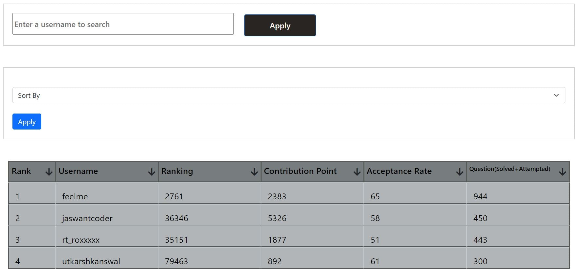

# Leetcode-Ranklist

> It is the Leetcode ranklist in which User Can enter his username and accordingly on the basis of number of question solved , acuuracy etc it will ranked the user.
<br>



## To use it I already Hosted it 

- **Go to [This Link](https://leetcode-ranklist.herokuapp.com/)**

## Steps to Use the Application Locally

> You should have `npm`, `node` and `mongodb` install in your computer to use it locally . 


- **Firstly Clone the Repository Using Below commands**
```Javascript
git clone https://github.com/utkarshkanswal/Leetcode-Ranklist-Generator-.git
```


- **Download and install MongoDb You can see the whole Downloading and installing Procedure from [Here](https://www.youtube.com/watch?v=_lLz56gRYe4)**

- **Open Windows Powershell and write below command and Press Enter**
```Javascript
mongod
```

- **Please Follow all the Steps Mentioned in above Video**

- **After that open Cmd/Terminal and goto directory where the cloned files are stored**

- **Then Run Command**
```Javascript
npm install
```
```Javascript
nodemon app.js
```

- **Then got any web browser and go to Url http://localhost:3000/**

>Hurray! You can use the Ranklist generator now

